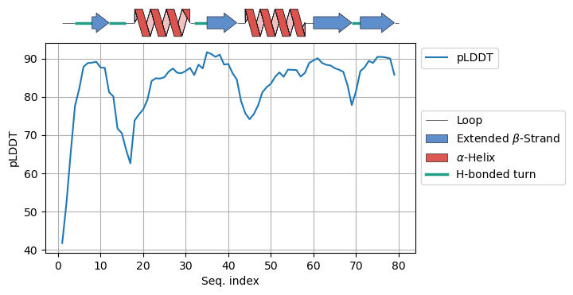
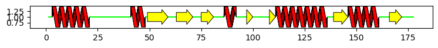
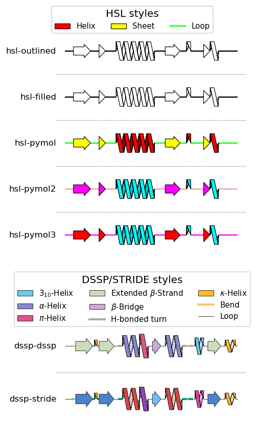

[](https://github.com/aethertier/secstructartist)
[](https://pypi.org/project/secstructartist/)
[](https://pypi.org/project/secstructartist/)
[](https://www.gnu.org/licenses/gpl-3.0)

# secstructartist

This package allows to include pretty secondary structure schemes in 
matplotlib plots.




## Table of content

* [Installation](#installation)
    * [Prerequisites](#prerequisites)
    * [Installation from PyPI](#installation-from-pypi)
    * [Installation from GitHub](#installation-from-github)
* [Usage](#usage)
    * [A simple example](#a-simple-example)
    * [Additional styles](#additional-styles)
* [License](#license)
* [Contributing](#contributing)
* [Authors](#authors)


## Installation

### Prerequisites

* **General prerequisites:**
    * Python 3.10 or higher
    * pip
* **Third-party python packages:**
    * matplotlib
    * numpy

### Installation from PyPI

This is the recommended way to install the package.

```shell
# 1. Create a virtual environment (optional but recommended)
python3 -m venv secstructartist
source secstructartist/bin/activate

# 2. Install the Python module
pip install secstructartist
```

### Installation from GitHub

Here, you will download the repository, and manually build and install the
package.

```shell
# 1. Create a virtual environment (optional but recommended)
python3 -m venv secstructartist
source secstructartist/bin/activate

# 2. Clone the repository
git clone https://github.com/bickeld/secstructartist.git
cd secstructartist

# 3. Install the package
make install

# 4. Test installation (optional)
make test
```

## Usage

In the `examples/` directory there are 
[Jupyter notebooks](https://github.com/bickeld/secstructartist/blob/main/examples/example_plots.ipynb) 
with plenty of code examples on how for simple and advanced use cases. 
Therefore, only the basic usage will be covered here.

### A simple example

```python
import secstructartist as ssa

secstruct_str = (
    'LLHHHHHHHHHHHHHHHHHHLLLLLLLLLLLLLLLLLLLLHHHHHHHLSSSSSSSSSSLL'
    'LLSSSSSSSSLLLLSSSSSSLLLLLHHHHHHLLLLLSSSLLLLLLLLSSSHHHHHHHHHH'
    'HHHHHHHHHHHHHHHLLLSSSSSSSHHHHHHHHHHHHHHHLLLLLSSSSSSLLLLLL'
)

ssa.draw_secondary_structure(secstruct_str)
```



### Additional styles

The module comes with a couple of preset styles to choose from. These preset 
styles come in two categories.

**HSL styles** are intended for simple intuitive visualizations of secondary 
structure. They only support three distinct types of elements:

* `H` = helix
* `S` = sheet
* `L` = loop

**DSSP styles** use the full range of secondary structure elements returned by
software like DSSP or STRIDE. This results in more complex secondary structure
representations with up to nine distinct elements + unstructured residues:

* `H` = α-helix
* `B` = residue in isolated β-bridge
* `E` = extended strand, participates in β ladder
* `G` = 3<sub>10</sub>-helix
* `I` = π-helix
* `P` = κ-helix (poly-proline II helix)
* `T` = hydrogen-bonded turn
* `S` = bend
* `C`, ` ` = unstructured coil

Moreover, users are free to define their own styles, and save them as custom 
configuration styles for later use. For examples in how to create custom styles, 
please, refer to this [Jupyter notebook](https://github.com/bickeld/secstructartist/blob/main/examples/example_artistdef.ipynb).




## License

Distributed under the GNU General Public License v3 (GPLv3) License.


## Contributing

If you find a bug, please open a [bug report](https://github.com/bickeld/secstructartist/issues/new?labels=bug).
If you have an idea for an improvement or new feature, please open a [feature request](https://github.com/bickeld/secstructartist/issues/new?labels=enhancement).


## Authors

[](https://orcid.org/0000-0003-0332-8338) - David Bickel
